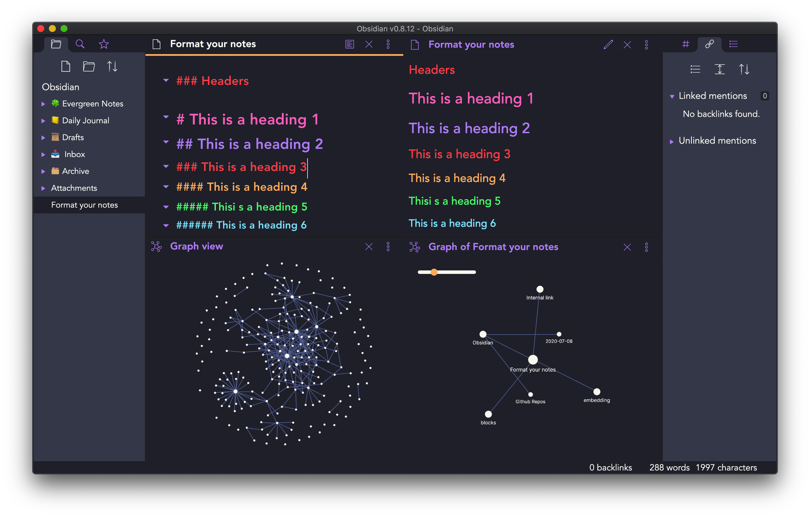

# Dracula for [Obsidian.md](https://obsidian.md) (Merlin's Version)

> A dark theme for [Obsidian](https://obisidian.md), compatible to Obsidian V0.16.00

## Install
(this is hacky and should be way easier but I tested the default installation method for non features themes and it didn't work)

1. Download the theme.css file.

2. In Obsidian, install any Plugin you want to replace (like the normal "Dracula for Obsidian")

3. Navigate to `/[yourvault]/.obsidian/themes/[themename]` (note: `.obsidian` is hidden!)

4. Replace the "theme.css" in that folder with the downloaded one.

5. Restart Obsidian.

## Creator

This theme is created and maintained by jarodise. 
[Twitter](https://twitter.com/jarodise) / [Instagram](https://www.instagram.com/jarodise)

*The CSS modification of the newest version is based on ["Pisum" by MooddooM](https://github.com/GuangluWu/obsidian-pisum)

*This fork was modified by [allesman](https://allesman.net) to have slightly darker colors and a monospace font

## License

[MIT License](./LICENSE)

